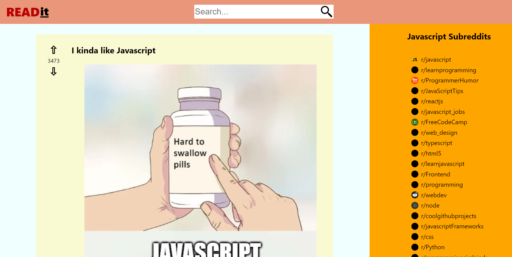

# ReadIt
This was created as a final project in Codecademy Front-end developer course. Main goal was to practice Redux and to incorporate it in a functioning app. 
Application is **read-only**, as it fetches data from unofficial Reddit JSON API, therefore it doesn't require any access token.

## Features
This SPA is able to display Reddit posts in main panel. Each post is clickable, so user can get detail of each post and get list of comments, related to the post. 
Sidebar contains chosen subreddits, related to Javascript & programming in general. 

## Technologies
Whole app is written in **Javascript**, specifficaly in **React** framework and **Redux**.

## Usage 
App is available on [this link](https://my-readit.netlify.app/)

To run it locally: 
* clone or download this repository
* in terminal open the directory and run `npm install` command
* run the app using `npm start`